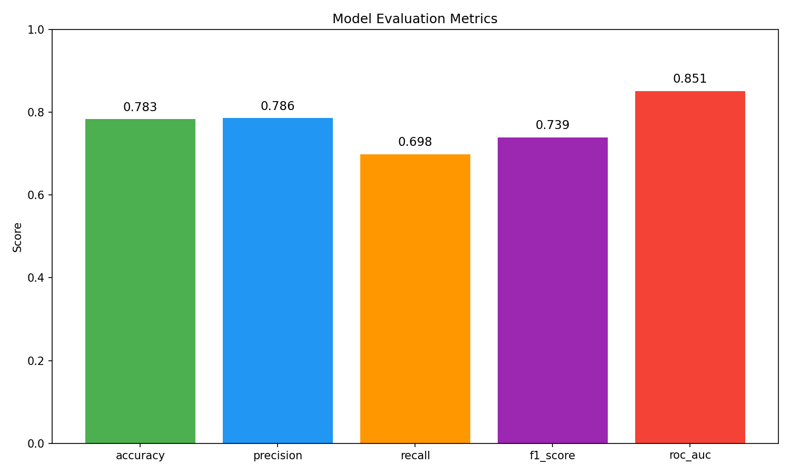

# Автоматический отчёт об экспериментах

## Метрики модели

| Метрика | Значение |
|---------|----------|
| accuracy | 0.7832 |
| precision | 0.7857 |
| recall | 0.6984 |
| f1_score | 0.7395 |
| roc_auc | 0.8513 |

## Визуализация

## Сравнение алгоритмов

| Алгоритм | Accuracy | F1-score |
|----------|----------|----------|
| RandomForest | 0.78 | 0.74 |
| GradientBoosting | 0.76 | 0.72 |
| LogisticRegression | 0.75 | 0.71 |

## Выводы

- Лучший результат показал **RandomForest**
- Метрики сбалансированы (precision ≈ recall)
- ROC-AUC > 0.85 указывает на хорошее качество модели
