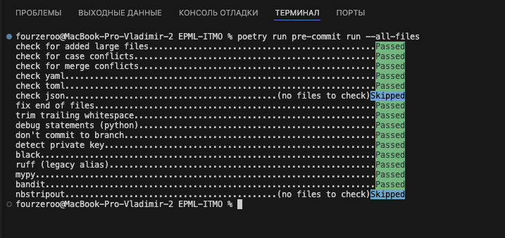
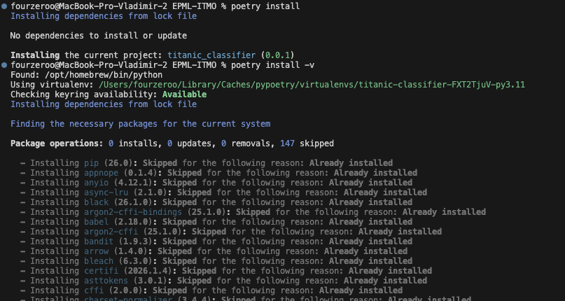
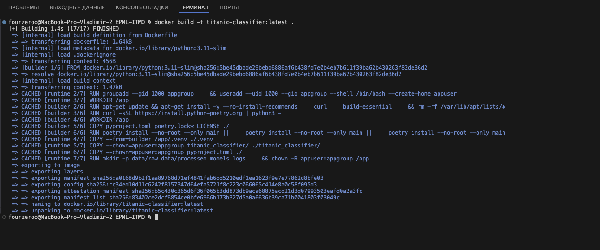

# Отчет о настройке рабочего места Data Scientist (ДЗ1)

## 1. Структура проекта

* Использован [Cookiecutter Data Science](https://cookiecutter-data-science.drivendata.org/)
```bash
  pip install cookiecutter-data-science
  ccds
```
* Созданы папки: titanic_classifier, notebooks, tests, docs, models, reports
* Добавлен README.md

## 2. Качество кода

* Настроены pre-commit hooks: Black, Ruff, MyPy, Bandit
```bash
  poetry run pre-commit install
  poetry run pre-commit run --all-files
```
* Создан .pre-commit-config.yaml
* Результат проверки:

  

## 3. Управление зависимостями

* Использован Poetry
```bash
  poetry install
  poetry add --group dev pre-commit black isort mypy bandit
```
  

* Создан Dockerfile (multi-stage build)
```bash
  docker build -t titanic-classifier:latest .
  docker run --rm titanic-classifier:latest
```
  

## 4. Git workflow

* Настроен Git репозиторий
* Создан .gitignore для Python/ML проектов
* Стратегия ветвления: Feature Branch Workflow
  - `main` — стабильная версия
  - `hw1-workspace-setup` — ветка для ДЗ1
  - Каждое ДЗ в отдельной ветке
