# Отчет о версионировании данных и моделей (ДЗ2)

## 1. Версионирование данных — DVC

### 1.1 Установка DVC
```bash
poetry add dvc
poetry run dvc --version
```

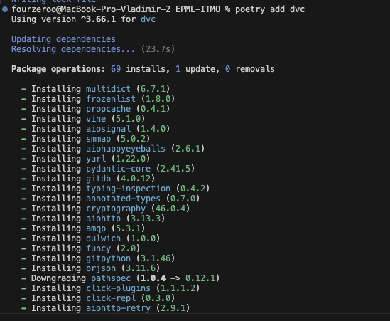

### 1.2 Инициализация DVC
```bash
poetry run dvc init
```

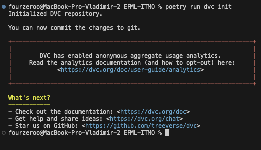

### 1.3 Настройка Remote Storage
```bash
mkdir -p ~/dvc-storage
poetry run dvc remote add -d myremote ~/dvc-storage
poetry run dvc remote list
```

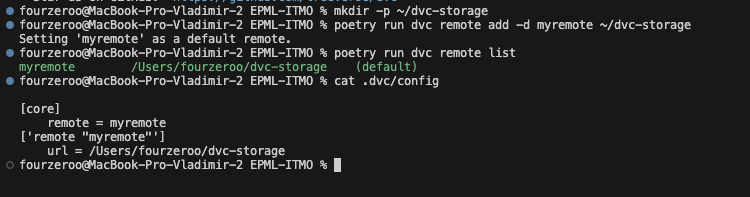

### 1.4 Добавление данных под версионирование
```bash
poetry run dvc add data/raw/train.csv
poetry run dvc push
```

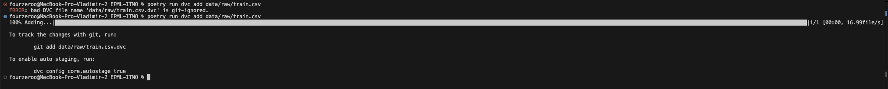

### 1.5 Создание версий данных

- **v1:** Исходные данные (891 строка)
- **v2:** Очищенные данные без пропусков в Age (714 строк)

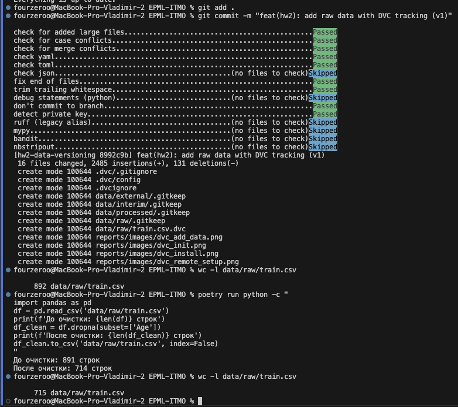

### 1.6 Переключение между версиями
```bash
# Переключение на v1
git checkout HEAD~1 -- data/raw/train.csv.dvc
poetry run dvc checkout

# Возврат на v2
git checkout HEAD -- data/raw/train.csv.dvc
poetry run dvc checkout
```

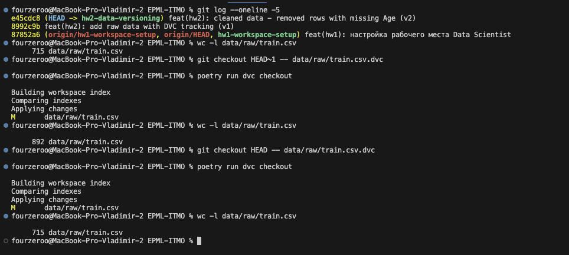

---

## 2. Версионирование моделей — MLflow

### 2.1 Установка MLflow
```bash
poetry add mlflow
poetry run mlflow --version
```

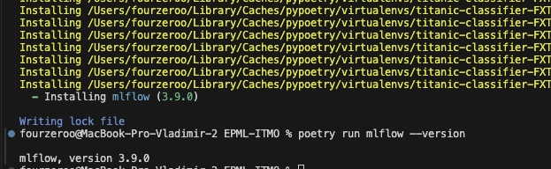

### 2.2 Запуск MLflow UI
```bash
poetry run mlflow ui --host 127.0.0.1 --port 5000
```

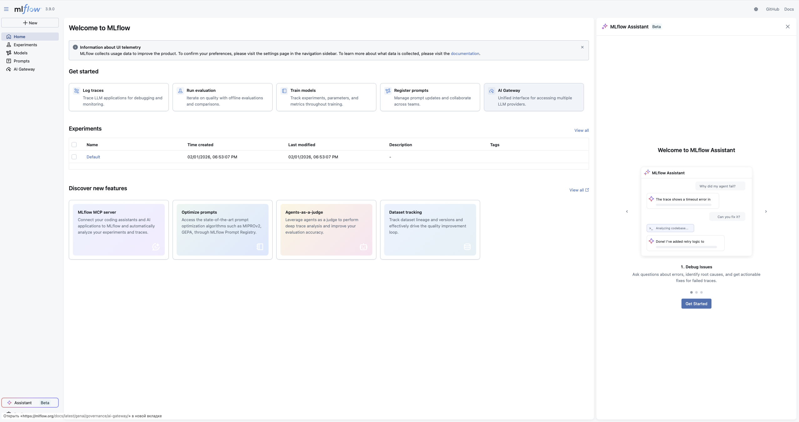

### 2.3 Обучение моделей с логированием

Обучены 4 модели с логированием параметров и метрик:
- RandomForest (n_estimators=50)
- RandomForest (n_estimators=100)
- RandomForest (n_estimators=200)
- LogisticRegression
```bash
poetry run python titanic_classifier/modeling/train_mlflow.py
```

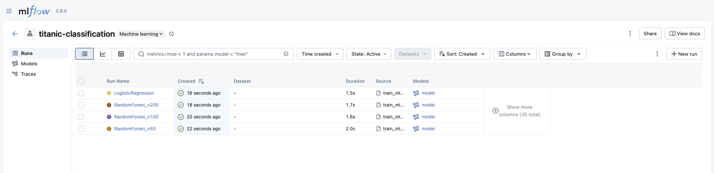

### 2.4 Эксперименты в MLflow UI

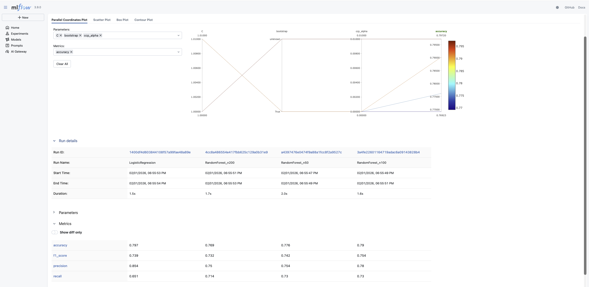

### 2.5 Регистрация модели в Model Registry
```python
mlflow.register_model(model_uri, 'titanic-classifier')
```

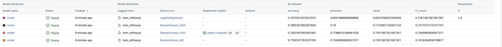

---

## 3. Воспроизводимость

### 3.1 Docker
```bash
docker build -t titanic-classifier:latest .
```


### 3.2 Инструкции по воспроизведению
```bash
# 1. Клонировать репозиторий
git clone https://github.com/Fourzeroo/EPML-ITMO.git
cd EPML-ITMO
git checkout hw2-data-versioning

# 2. Установить зависимости
poetry install

# 3. Получить данные из DVC
poetry run dvc pull

# 4. Запустить MLflow UI
poetry run mlflow ui --host 127.0.0.1 --port 5000

# 5. Обучить модели
poetry run python titanic_classifier/modeling/train_mlflow.py
```

---

## 4. Итоги

| Компонент | Инструмент | Статус |
|-----------|------------|--------|
| Версионирование данных | DVC + локальный remote | ✅ |
| Версионирование моделей | MLflow Model Registry | ✅ |
| Воспроизводимость | Docker + инструкции | ✅ |
