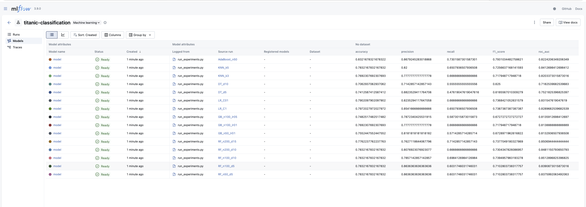
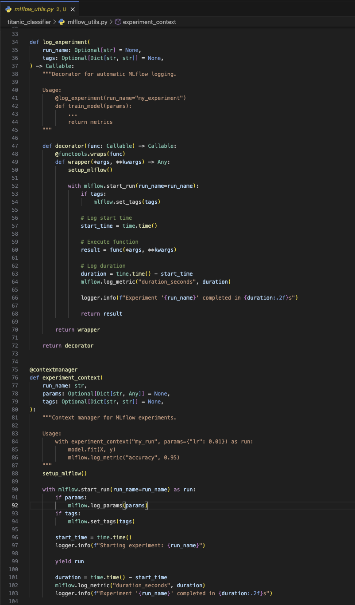

# Отчет о трекинге экспериментов (ДЗ3)

## 1. Настройка инструмента

### Выбор инструмента: MLflow

MLflow выбран как основной инструмент для трекинга экспериментов.

### Конфигурация

Создан файл конфигурации `titanic_classifier/config.py`:
- SQLite backend для хранения экспериментов
- Локальное хранилище артефактов
- Централизованные настройки проекта
```python
MLFLOW_TRACKING_URI = "sqlite:///mlflow/mlflow.db"
MLFLOW_ARTIFACT_LOCATION = "mlflow/artifacts"
MLFLOW_EXPERIMENT_NAME = "titanic-experiments"
```

### Запуск MLflow UI
```bash
poetry run mlflow ui --backend-store-uri sqlite:///mlflow/mlflow.db --host 127.0.0.1 --port 5000
```

## 2. Проведение экспериментов

### Проведено 15 экспериментов с разными алгоритмами:

| Алгоритм | Количество экспериментов | Варьируемые параметры |
|----------|--------------------------|----------------------|
| RandomForest | 5 | n_estimators, max_depth |
| GradientBoosting | 3 | n_estimators, learning_rate |
| LogisticRegression | 2 | C (регуляризация) |
| DecisionTree | 2 | max_depth |
| KNN | 2 | n_neighbors |
| AdaBoost | 1 | n_estimators |

### Логируемые данные:
- **Параметры:** все гиперпараметры моделей
- **Метрики:** accuracy, precision, recall, f1_score, roc_auc
- **Артефакты:** обученные модели (sklearn)

### Запуск экспериментов
```bash
poetry run python titanic_classifier/modeling/run_experiments.py
```



## 3. Интеграция с кодом

### Созданы утилиты в `titanic_classifier/mlflow_utils.py`:

#### Декоратор `@log_experiment`
Автоматическое логирование для функций обучения:
```python
@log_experiment(run_name="my_model", tags={"version": "1.0"})
def train_model():
    model.fit(X, y)
    return metrics
```

#### Контекстный менеджер `experiment_context`
Гибкий контроль над экспериментами:
```python
with experiment_context("my_run", params={"lr": 0.01}) as run:
    model.fit(X, y)
    mlflow.log_metric("accuracy", acc)
```

#### Утилиты
- `log_model_metrics()` — логирование метрик классификации
- `get_best_run()` — получение лучшего эксперимента
- `setup_mlflow()` — инициализация MLflow


