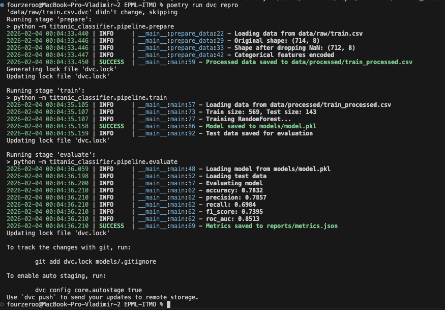
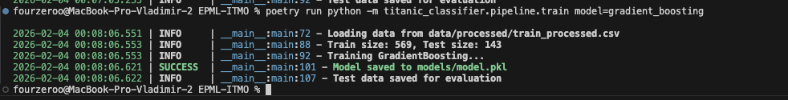

# Отчет об автоматизации ML пайплайнов (ДЗ4)

## 1. Оркестрация пайплайнов — DVC Pipelines

### Структура пайплайна

Создан `dvc.yaml` с тремя этапами:
```
data/raw/train.csv → prepare → train → evaluate
```

| Этап | Описание | Выходы |
|------|----------|--------|
| prepare | Загрузка и предобработка данных | train_processed.csv |
| train | Обучение модели | model.pkl, X_test.csv, y_test.csv |
| evaluate | Оценка метрик | metrics.json |

### Запуск пайплайна
```bash
poetry run dvc repro
```



### Преимущества DVC Pipelines

- **Кэширование:** повторный запуск пропускает неизменённые этапы
- **Воспроизводимость:** `dvc.lock` фиксирует версии данных
- **Граф зависимостей:** `dvc dag` показывает структуру пайплайна

## 2. Управление конфигурациями — Hydra

### Структура конфигов
```
configs/
├── config.yaml          # главный конфиг
├── data/
│   └── default.yaml     # параметры данных
├── model/
│   ├── random_forest.yaml
│   ├── gradient_boosting.yaml
│   └── logistic_regression.yaml
└── train/
    └── default.yaml     # параметры обучения
```

### Композиция конфигов

Главный конфиг `configs/config.yaml`:
```yaml
defaults:
  - data: default
  - model: random_forest
  - train: default
```

### Переключение моделей через CLI
```bash
# RandomForest (по умолчанию)
poetry run python -m titanic_classifier.pipeline.train

# GradientBoosting
poetry run python -m titanic_classifier.pipeline.train model=gradient_boosting

# LogisticRegression
poetry run python -m titanic_classifier.pipeline.train model=logistic_regression
```



## 3. Интеграция и тестирование

### Интеграция DVC + Hydra + MLflow

- **DVC:** оркестрация и версионирование пайплайна
- **Hydra:** управление конфигурациями
- **MLflow:** логирование экспериментов

### Воспроизводимость
```bash
# Клонировать и воспроизвести
git clone https://github.com/Fourzeroo/EPML-ITMO.git
cd EPML-ITMO
git checkout hw4-automation
poetry install
poetry run dvc pull
poetry run dvc repro
```
