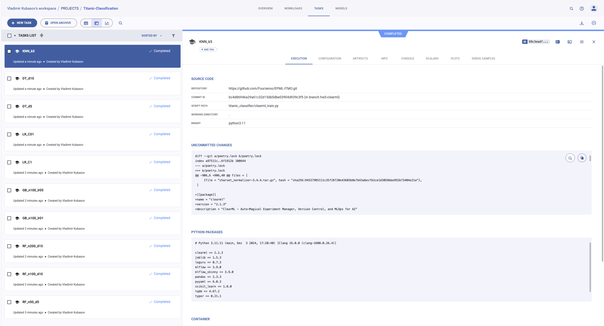
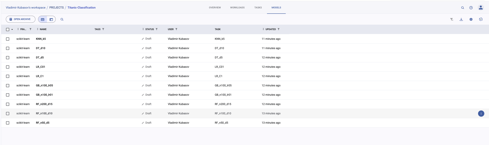
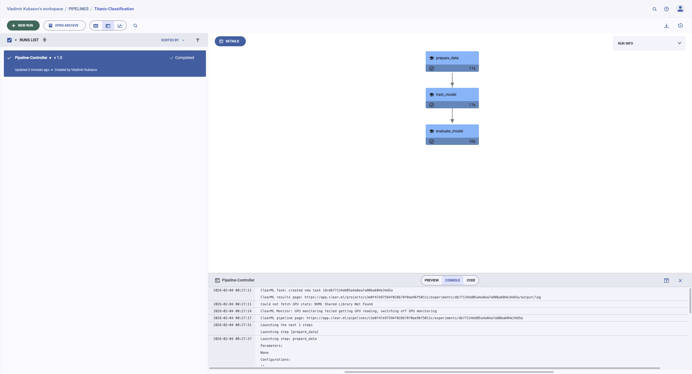

# Отчет о ClearML для MLOps (ДЗ5)

## 1. Настройка ClearML

### Установка
```bash
poetry add clearml
poetry run clearml-init
```

### Конфигурация
- Использован бесплатный облачный сервер: https://app.clear.ml
- Создан проект: **Titanic-Classification**
- Настроена аутентификация через credentials

## 2. Трекинг экспериментов

### Проведено 10 экспериментов с разными алгоритмами:

| Алгоритм | Эксперименты |
|----------|--------------|
| RandomForest | RF_n50_d5, RF_n100_d10, RF_n200_d15 |
| GradientBoosting | GB_n100_lr01, GB_n100_lr05 |
| LogisticRegression | LR_C1, LR_C01 |
| DecisionTree | DT_d5, DT_d10 |
| KNN | KNN_k5 |

### Автоматическое логирование:
- Гиперпараметры моделей
- Метрики: accuracy, precision, recall, f1_score, roc_auc
- Артефакты моделей



## 3. Управление моделями

### Model Registry
Все модели автоматически зарегистрированы в ClearML Model Registry:
```python
output_model = OutputModel(task=task, framework="scikit-learn")
output_model.update_weights(str(model_path))
```



## 4. Пайплайны

### ClearML Pipeline
Создан pipeline с тремя этапами:
```
prepare_data → train_model → evaluate_model
```

### Код pipeline:
```python
pipe = PipelineController(
    name="Titanic-ML-Pipeline",
    project="Titanic-Classification",
    version="1.0",
)

pipe.add_function_step(name="prepare_data", ...)
pipe.add_function_step(name="train_model", ...)
pipe.add_function_step(name="evaluate_model", ...)

pipe.start_locally()
```


