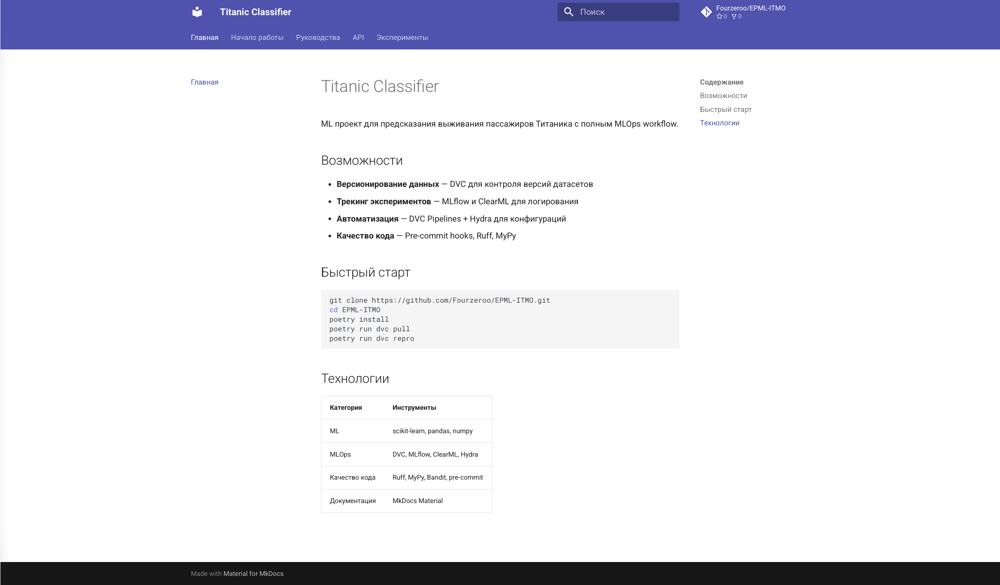
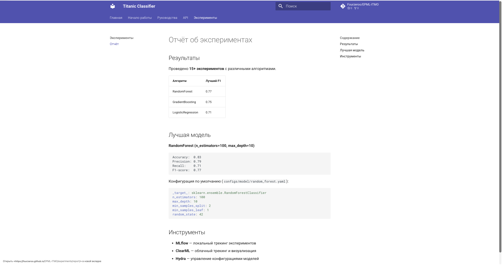

# Отчет о документации и отчетах (ДЗ6)

## 1. Техническая документация

### MkDocs Material

Создана документация с использованием MkDocs и темы Material:
```
docs/
├── mkdocs.yml
└── docs/
    ├── index.md
    ├── getting-started.md
    ├── guides/
    │   ├── installation.md
    │   ├── usage.md
    │   └── deployment.md
    ├── api/
    │   ├── models.md
    │   └── utils.md
    └── experiments/
        └── report.md
```

### Локальный запуск
```bash
cd docs
poetry run mkdocs serve
```



## 2. Публикация в Git Pages

### GitHub Actions

Создан workflow `.github/workflows/docs.yml` для автоматического деплоя:

- Триггер: push в main или hw6-documentation
- Сборка: MkDocs build
- Деплой: GitHub Pages

### Сайт

URL: https://fourzeroo.github.io/EPML-ITMO/



## 3. Отчёты об экспериментах

### Автоматическая генерация

Скрипт `titanic_classifier/generate_report.py`:
```bash
poetry run python titanic_classifier/generate_report.py
```

Генерирует:
- `reports/figures/metrics_chart.png` — график метрик
- `reports/experiment_report.md` — Markdown отчёт

### Визуализация


## 4. Воспроизводимость
```bash
# Клонировать
git clone https://github.com/Fourzeroo/EPML-ITMO.git
cd EPML-ITMO

# Установить
poetry install

# Данные
poetry run dvc pull

# Пайплайн
poetry run dvc repro

# Отчёт
poetry run python titanic_classifier/generate_report.py

# Документация
cd docs && poetry run mkdocs serve
```
